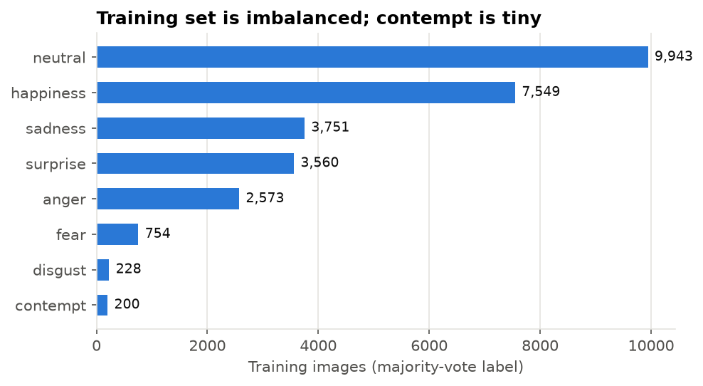
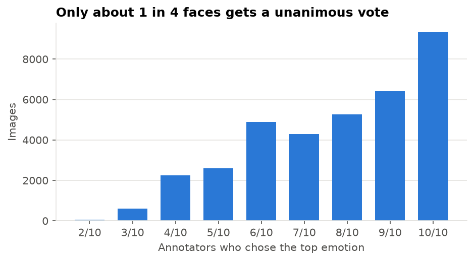
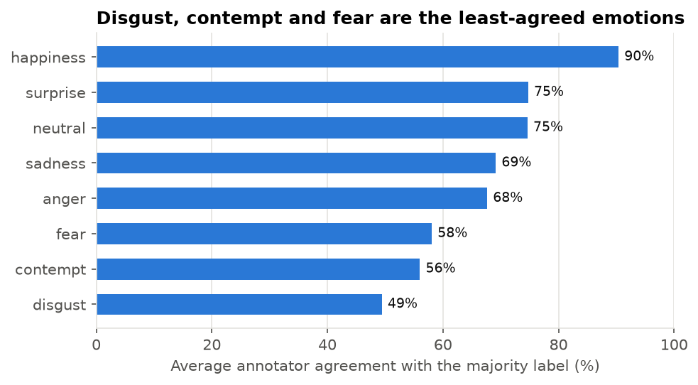
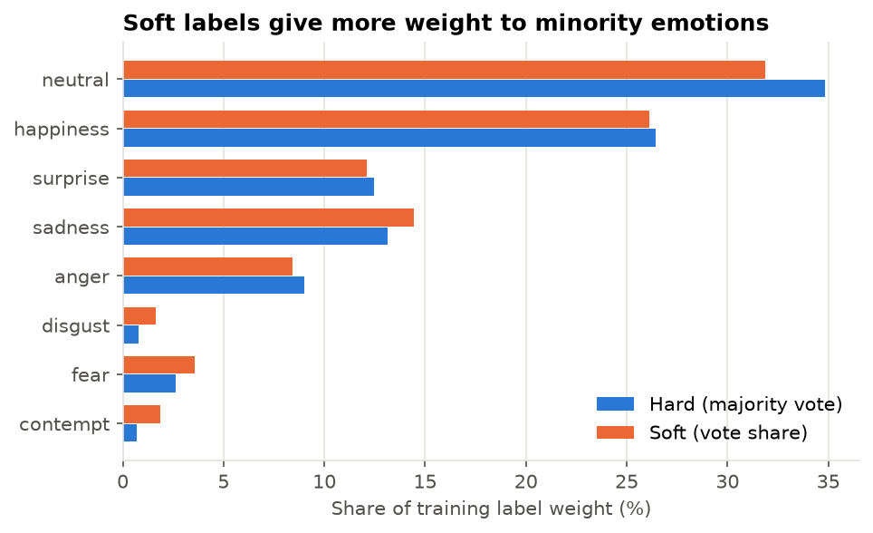
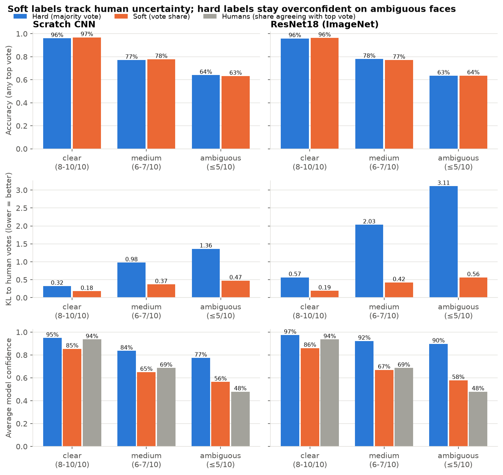
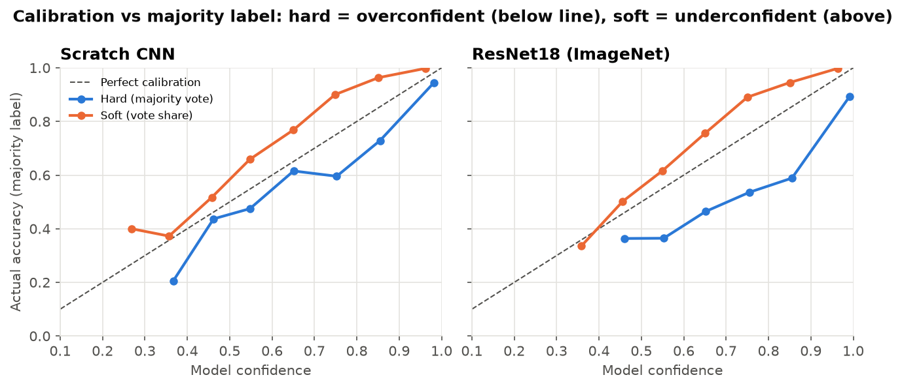
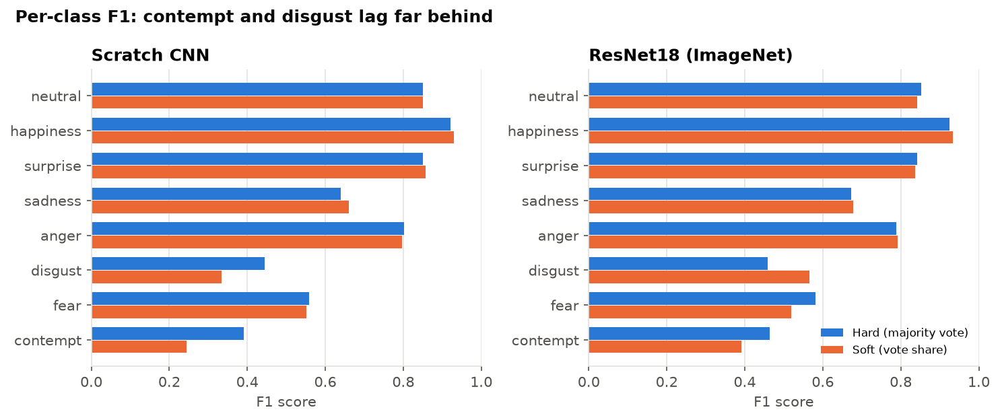

# Facial Expression Recognition: Hard vs Soft Labels on FER+

Each face in FER+ was labeled by 10 people, and they often disagree. This project
compares a model trained on the **majority vote** (one "correct" emotion per face)
against one trained on the **full vote distribution** (e.g. 60% happy, 40% surprise),
to see which one handles ambiguous faces better. It uses a small CNN trained from
scratch and an ImageNet-pretrained ResNet18, keeps all 8 emotion classes, trains on
Apple Silicon (`mps`), and ends with a real-time webcam demo.

> **Status:** complete: data, training, evaluation ([Results](#results)) and the
> [webcam demo](#webcam-demo).

## Tools and libraries

| Tool | Why |
|---|---|
| **PyTorch + torchvision** | Training on the Mac GPU via `mps`; torchvision provides the pretrained ResNet18 |
| **pandas / NumPy** | Reading the CSVs and building label arrays |
| **matplotlib** | Exploration and result charts |
| **scikit-learn** | Evaluation metrics (confusion matrix, per-class F1) |
| **OpenCV** (4.x) | Face detection and camera capture for the webcam demo. Pinned below 5.0, because 5.x no longer ships the Haar face detector |
| **pytest** | Tests for the label logic, models and loss |

## File structure

```
facial-expression-recognition/
├── data/                         # not committed (dataset license; too large)
│   ├── raw/fer2013.csv           # 35,887 faces as pixel strings + official split
│   ├── raw/fer2013new.csv        # FER+ crowd votes (10 annotators per face)
│   └── processed/ferplus.npz     # images + hard/soft labels, built by prepare_data
├── results/
│   ├── data_summary.md           # class counts, ambiguity stats, contempt, duplicates
│   ├── results.md                # all test-set tables (full and without duplicates)
│   ├── metrics.json              # the same numbers, machine-readable
│   └── figures/                  # exploration and result charts
├── runs/                         # not committed: checkpoints + training history
├── weights/
│   └── cnn_soft.pt               # trained soft-label CNN (19 MB), so the demo runs right after cloning
├── src/
│   ├── config.py                 # paths, class names, constants
│   ├── data.py                   # alignment check, hard/soft label building, loading
│   ├── prepare_data.py           # script: verify CSVs, save ferplus.npz
│   ├── explore.py                # script: exploration figures + data_summary.md
│   ├── models.py                 # scratch CNN and ResNet18 (both take 48x48 grayscale)
│   ├── train.py                  # script: train one model on hard or soft labels
│   ├── evaluate.py               # script: test-set metrics for all 4 models
│   ├── report.py                 # writes results.md and the result figures
│   └── webcam.py                 # script: real-time demo (or --image for a photo)
├── tests/
│   ├── test_data.py              # label building, tie-breaks, row dropping, alignment
│   ├── test_models.py            # output shapes, loss correctness, augmentation
│   ├── test_evaluate.py          # KL, calibration error, tie-aware accuracy, buckets
│   └── test_webcam.py            # face preprocessing, smoothing, uncertain labels
├── requirements.txt
└── README.md
```

## Setup

1. Create the environment:
   ```bash
   conda create -n facial-expression-recognition python=3.11 -y
   conda activate facial-expression-recognition
   pip install -r requirements.txt
   ```
2. Get the data and put both files in `data/raw/`:
   - `fer2013.csv` from the Kaggle FER2013 challenge (or a mirror of that same CSV;
     **not** the version with images sorted into folders, which loses row order)
   - `fer2013new.csv` from https://github.com/microsoft/FERPlus

## How to run

**Just the webcam demo:** once the environment from Setup step 1 is ready, no dataset or training is needed,
because the trained soft-label CNN ships in `weights/`:
```bash
python -m src.webcam
```

**The full pipeline** (needs the dataset from Setup step 2):

```bash
python -m src.prepare_data      # verify the CSVs line up, build data/processed/ferplus.npz
python -m src.explore           # figures + results/data_summary.md
python -m src.train --model cnn --labels hard      # one of 4 training runs (~10-17 min each)
python -m src.evaluate          # test-set results -> results/results.md + figures
python -m src.webcam            # live demo (press q to quit)
python -m pytest                # run the tests
```

The four runs are every combination of `--model {cnn,resnet18}` and `--labels {hard,soft}`.

## How it was built

1. **Checked the data lines up.** FER+ votes are matched to FER2013 images by row
   position only, so `prepare_data` checks the row counts and the `Usage` column row
   by row. As an extra check, the original FER2013 label agrees with the FER+ top
   vote on 62.8% of rows; shifting by one row drops that to 18% (chance).
2. **Built both label types on the same images.** We dropped 178 rows with no image
   or a top vote of "not a face". For every remaining image:
   - *soft label* = the 8 emotion vote counts divided by their total
   - *hard label* = the emotion with the most votes; the 1,668 ties (4.7%) are broken
     by a random choice with a fixed seed, so both models see exactly the same images
3. **Explored the data** (figures below).
4. **Wrote the training code.** Hard and soft runs share images, image order,
   augmentation, learning-rate schedule and loss. A hard label is a one-hot
   distribution, so one loss function handles both.
5. **Trained 4 models** (30 epochs each on `mps`): scratch CNN and ResNet18, each with hard and soft labels.
6. **Evaluated on the test set**, both in full and with train duplicates removed: accuracy,
   F1, KL to human votes, calibration, results by ambiguity, and bootstrap intervals.
7. **Chose a model for the demo** by comparing the two soft-label models on both test sets and on speed.
8. **Built the webcam demo:** face detection → 48×48 crop → model → smoothed probability bars.

### What the data looks like

| | |
|---|---|
|  |  |
|  |  |

- Only **26%** of faces get a unanimous vote; on **15%**, the top emotion gets 5 or fewer of 10 votes.
- **Contempt** is the majority label for just 266 of 35,709 images (0.74%): 200 in train
  and 34 in test. Annotators also agree with each other less on contempt (56% on average).
  Expect low per-class scores for contempt from any model. With 34 test images,
  its scores will also be noisy.
- Soft labels give minority emotions more total training weight. Contempt's share
  goes from 0.7% (hard) to 1.8% (soft), because 4,006 images got at least one contempt vote.

### Data quirks worth knowing

- **Duplicate images across splits:** 279 val and 288 test images have a pixel-identical
  copy in train. We keep the official splits so the numbers compare with published work.
- **Reused filenames in `fer2013new.csv`:** 4 image names appear twice, and 2 of those
  pairs are different faces. This doesn't affect us, because we match by row, not by name.

## Results

Full tables: [results/results.md](results/results.md). Test set = FER+ PrivateTest.

| model | Acc (majority) | Macro F1 | KL to votes ↓ | Avg confidence |
|---|---:|---:|---:|---:|
| CNN · hard | 82.5% | 0.682 | 0.707 | 88% |
| CNN · soft | 82.9% | 0.653 | **0.288** | 74% |
| ResNet18 · hard | 82.8% | 0.698 | 1.469 | 95% |
| ResNet18 · soft | 82.5% | 0.695 | **0.327** | 75% |

Without the 288 test images duplicated in train (n = 3,285), every model loses about 0.4–1.3 accuracy
points, and macro F1 drops by 0.02–0.05, mostly because disgust and contempt get harder. The
hard-vs-soft conclusions below stay the same.



**What we found**

1. **Accuracy: no difference.** Soft − hard accuracy is between −1% and +1.7%, and every 95%
   bootstrap interval includes 0. That holds for both models and both test sets.
2. **Matching human judgment: soft labels win clearly.** KL to the vote distribution drops by
   59% for the CNN and 78% for ResNet18. The intervals are far from 0. The gap grows with
   ambiguity: on faces where ≤5/10 annotators agreed, hard-label ResNet18 has a KL of 3.11, versus 0.56 for soft.
3. **Hard labels make models overconfident on ambiguous faces.** When only 48% of humans agree,
   hard-label ResNet18 is still 90% confident on average. The soft-label model is 58% confident.
4. **Soft labels make the model somewhat *under*confident when judged against the majority
   label** (see the calibration chart). It learned to hedge like the crowd does, but the
   majority answer is correct more often than any individual annotator. So the soft model's
   ECE isn't always better than the hard model's (CNN: 0.088 soft vs 0.059 hard).

So which handles ambiguous faces better? **The soft-label model.** It is just as accurate, and its
probabilities reflect real disagreement instead of false certainty. This matters if the output is
used as a confidence (for example, in the webcam demo), not just as a top-1 label.



### The contempt problem



Contempt is the weakest class for every model: F1 ranges from 0.24 to 0.46, and the best model gets
13 of the 34 test images right. The usual mistake is predicting **neutral** (see
[the confusion matrices](results/figures/results_confusion.png)), which makes sense: contempt is a
subtle, one-sided expression. There are three reasons:
- **Very little data:** only 200 majority-contempt training images (0.7%).
- **Humans disagree too:** annotators agree with the majority only 56% of the time on contempt faces.
- **Too few test images to measure:** with 34 examples, one more or fewer correct changes recall by 3 points.

Soft labels *lowered* contempt F1 here (0.39 → 0.24 for CNN, 0.46 → 0.39 for ResNet18). A soft
target never pushes a contempt face all the way to "contempt". It gives partial credit to the
neutral votes that usually come with it. That is our likely explanation (not tested): it would make the model rarely choose contempt as its top pick. Treat
contempt numbers as rough. Class weighting or oversampling would be the next thing to try.

### Limitations

- **One training run per model (seed 42).** The bootstrap intervals cover test-set sampling, not
  training randomness. Small differences (e.g. per-class F1 for rare classes) could flip with another seed.
- **The final epoch was used, with no tuning.** Both label types use the same hyperparameters, chosen
  in advance. Neither is tuned to its best.

## Webcam demo

```bash
python -m src.webcam                         # default: soft-label scratch CNN (shipped in weights/)
python -m src.webcam --model resnet18_soft   # needs your own training run in runs/
python -m src.webcam --image photo.jpg       # annotate a photo instead
```

The first time, macOS asks for camera access for your terminal app. If you deny it, enable it
under System Settings → Privacy & Security → Camera, then restart the terminal.

**How it works:** each frame is mirrored and converted to grayscale. OpenCV's Haar detector
finds faces, and each face is cropped and resized to 48×48 like FER2013. The model outputs 8
probabilities, which are smoothed over frames (moving average) so the bars don't flicker. If the
top probability is under 50%, the label shows the top two (e.g. `uncertain: neutral 41% / sadness 33%`).
The bars show the largest face. Every detected face gets its own label.

### Which model, and why

The demo shows a probability for every emotion, so we want probabilities that match
how people actually vote. Accuracy alone isn't enough. Comparing the two soft-label models
(95% paired bootstrap interval for CNN − ResNet18 in brackets):

| | Soft CNN | Soft ResNet18 | Real difference? |
|---|---:|---:|---|
| Accuracy, full test | **82.9%** | 82.5% | no: [−0.7%, +1.5%] |
| Accuracy, without duplicates | **82.5%** | 81.6% | no: [−0.2%, +2.1%] |
| KL to votes, full / without duplicates | **0.288 / 0.296** | 0.327 / 0.349 | **yes, CNN better** on both |
| Macro F1, full / without duplicates | 0.653 / 0.629 | **0.695 / 0.661** | ResNet better on full; borderline without duplicates |
| Contempt / disgust F1 (full) | 0.24 / 0.33 | **0.39 / 0.57** | |
| Time per face on `mps` | **1.2 ms** | 2.4 ms | |
| Parameters | **4.7M** | 11.2M | |

**Default: soft-label CNN.** Its probabilities are measurably closer to human votes. Its accuracy
is tied with ResNet18 (slightly ahead, but not significantly). It is 2× faster and less than half
the size. Both models are far faster than a 30 fps frame (33 ms), so speed is a bonus, not
the deciding factor. **Trade-off:** the CNN is clearly worse on the rare classes, especially disgust
and contempt. If those matter to you, run `--model resnet18_soft`.

**Caveat (domain shift):** FER2013 faces come from web images, are tightly cropped, and are often
posed. A webcam has different lighting, angles and crops, so live predictions will be less reliable
than the test-set numbers. Use `--margin 0.1` to loosen the crop if predictions look off.

## Future improvements

In live use, happiness, surprise and sadness work well, but **anger and especially contempt drift
toward neutral**. That matches the test set: the soft CNN calls 44% of contempt faces neutral.
Neutral is 35% of the training data, so it's the model's default when unsure. Two fixes we
measured or considered but didn't build:

1. **A `--balance` option (no retraining).** Divide each predicted probability by that class's
   share of the training labels (raised to a power τ), then renormalize. This is called a
   *prior correction* or *logit adjustment*. On the test set with τ = 0.5, the soft CNN gets more
   faces right for anger (80% → 85%), contempt (15% → 26%), disgust (30% → 56%) and fear
   (47% → 62%). Overall accuracy drops (82.9% → 81.4%) and neutral drops (90% → 81%). With τ = 1,
   it overcorrects (accuracy 72.7%). The downside: the bars would no longer match how people vote,
   which is the point of the soft-label model, so this would be an opt-in switch.
2. **Retrain with class weights or oversampling,** so rare emotions count more in the loss.
   This would likely help contempt and disgust most. It costs about 10–17 minutes per model, plus
   re-running the evaluation, and it adds a new experiment variable.

Other ideas: train with several seeds to put error bars on training randomness; use a stronger
face detector (e.g. OpenCV's YuNet) for tilted faces; fine-tune on a few labeled webcam
frames to reduce domain shift.

## Key concepts

- **Hard vs soft labels:** a hard label says "this face is happy". A soft label says
  "6 of 10 people said happy, 4 said surprise". Soft labels keep the information about
  how ambiguous a face is.
- **Cross-entropy with a target distribution:** loss = −Σ target × log(prediction).
  With a one-hot target, this reduces to normal cross-entropy. That's why the two
  experiments can share one loss function.
- **KL divergence:** how far the model's predicted distribution is from the human vote
  distribution (0 = identical). It measures how well the model captures ambiguity,
  which accuracy can't.
- **Controlled experiment:** to credit the labels with any difference, everything else
  (images, order, augmentation, schedule, seed, number of epochs) is held fixed.
  We keep the final epoch's model instead of picking the "best" epoch, because the
  rule for "best" could favor one label type.
- **Transfer learning:** ResNet18 starts with features learned on ImageNet photos. We
  upscale the 48×48 grayscale face and copy it into 3 channels to match what it expects.
- **Class imbalance:** contempt and disgust have about 200 training examples each, versus
  about 10,000 for neutral. Overall accuracy hides how badly rare classes do, so we
  report per-class F1 too.
- **Data leakage:** duplicate images across train and test can make test scores look
  better than real-world performance. Here, removing them cost about 1 accuracy point and more on rare classes.
- **Calibration / ECE:** a model is calibrated if, among predictions made with 80% confidence,
  about 80% are right. Hard-label training pushes confidence toward 100% even on ambiguous inputs.
- **Bootstrap confidence interval:** resample the test set with replacement thousands of times and
  recompute the difference each time. The middle 95% of those differences is the interval.
  "Paired" means both models are scored on the same resampled images.
- **Choosing a model for a use case:** the "best" model depends on what the output is used for.
  For confidence bars, distribution match (KL) matters more than top-1 accuracy. For spotting
  rare expressions, macro F1 matters more.
- **Haar cascade face detection:** a fast, classic (pre-deep-learning) detector that slides
  simple light/dark patterns over the image. It's quick on a CPU, but it misses tilted or partly hidden faces.
- **Smoothing with a moving average:** new = α·current + (1−α)·previous. This trades a little
  lag for stable, readable bars.
- **Domain shift:** a model trained on one kind of image (web photos) can perform worse on
  another (your webcam), even when the task is the same.
